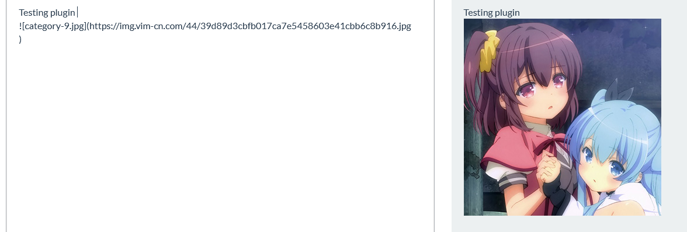
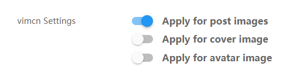

# NodeBB Plugin vimcn

A plugin that uploads images to vim-cn,  refer from nodebb-plugin-imgur

## Installation

    npm install nodebb-plugin-vimcn

## Usage

When upload a picture, it can upload to the vim-cn automatics and convert

the url in the markdown.

## Setup

You can set up upload which kind of pictures to  [vim-cn](https://img.vim-cn.com/).

